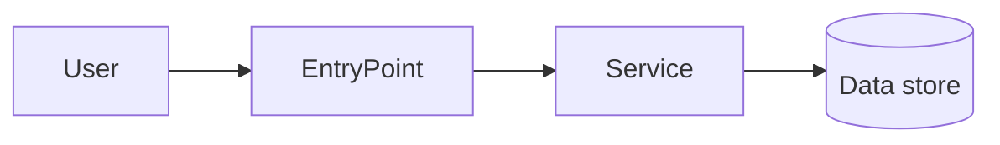
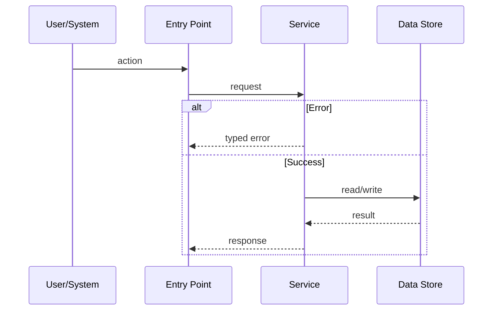

# PRD Creator

## Overview

You are a Principal Software Architect. Your mission is to produce an implementation plan so explicit that an engineer can implement it without guessing, then define disciplined verification checkpoints.

The output should be a PRD / implementation spec, not a vague plan. It must identify the exact integration points, files likely to change, test strategy, risks, and user-visible outcomes.

## When to Use

Use this skill when:

- A feature request needs to become an implementation-ready PRD.
- A task is complex enough that coding immediately would risk dead code, unclear wiring, or missing tests.
- You need to hand work to another agent/engineer with minimal ambiguity.
- You need a plan that can be executed phase-by-phase and verified after each phase.

Do not use this skill for:

- Tiny one-file fixes with obvious behavior.
- Pure research notes with no implementation target.
- Legal/HR/business documents that are not software implementation specs.

## Step 0: Complexity Assessment

Before writing any plan, determine complexity level:

```text
COMPLEXITY SCORE (sum all that apply):
+1  Touches 1-5 files
+2  Touches 6-10 files
+3  Touches 10+ files
+2  New system/module from scratch
+2  Complex state logic / concurrency
+2  Multi-package changes
+1  Database schema changes
+1  External API integration
```

- 1-3: LOW — minimal plan; skip sections marked MEDIUM/HIGH.
- 4-6: MEDIUM — standard plan; include all core sections.
- 7+: HIGH — full plan with explicit checkpoints after every phase.

Start the plan with:

```markdown
Complexity: [SCORE] → [LOW/MEDIUM/HIGH] mode
```

## Pre-Planning Checklist

Do this before writing the PRD:

1. **Explore:** Read relevant files. Never guess. Reuse existing code and project patterns.
2. **Verify:** Identify existing utilities, schemas, helpers, routes, services, tests, and config.
3. **Impact:** List files touched, features affected, and risks.
4. **Clarify:** Ask only when ambiguity changes implementation or verification.
5. **Integration points:** Identify exactly where and how the new code will be called.
6. **UI counterparts:** For user-facing features, plan the full UI path, not only backend code.

## Integration Points Checklist

Before writing a final plan, answer:

```markdown
**How will this feature be reached?**
- [ ] Entry point identified: [route, event, cron, CLI command, UI action]
- [ ] Caller file identified: [file that invokes the new behavior]
- [ ] Registration/wiring needed: [router, handler, menu, scheduler, dependency injection]

**Is this user-facing?**
- [ ] YES → UI components/pages/modals listed
- [ ] NO → Internal/background trigger explained

**Full user/system flow:**
1. User/system does: [action]
2. Triggers: [code path]
3. Reaches new feature via: [specific connection point]
4. Result appears in: [UI/API/log/output/state]
```

If this checklist cannot be completed, the design is incomplete.

## PRD Structure

### 1. Context

- **Problem:** One-sentence problem statement.
- **Goal:** What success looks like.
- **Non-goals:** What this PRD intentionally excludes.
- **Files analyzed:** Paths inspected.
- **Current behavior:** 3-5 bullets.

### 2. Solution

- **Approach:** 3-5 bullets explaining the chosen solution.
- **Integration points:** Where the feature is wired in.
- **Key decisions:** Framework/library choices, error handling, reuse of existing utilities.
- **Data changes:** Schemas, migrations, storage, or `None`.
- **Risks:** Technical, product, migration, security, performance.

For MEDIUM/HIGH complexity, include a diagram:



For MEDIUM/HIGH complexity, include a sequence flow:



### 3. Execution Phases

Rules:

1. Each phase is one user-testable vertical slice.
2. Prefer max 5 files per phase; split if larger.
3. Every phase includes concrete tests.
4. Every phase includes a checkpoint.
5. Dependencies between phases are explicit.

Phase template:

```markdown
#### Phase N: [Name] — [user-visible outcome]

**Dependencies:** Phase(s) required first, or `None`.

**Files:**
- `path/file.ext` — what changes

**Implementation:**
- [ ] Step 1
- [ ] Step 2

**Tests required:**
- `path/to/test.ext` — assertion(s)

**Verification:**
- Command: `...`
- Expected result: `...`

**Manual/user verification, if needed:**
- Action: [what to do]
- Expected: [what should happen]
```

### 4. Verification Strategy

Philosophy: do not trust — verify. The feature is only done when executable proof shows it works.

Use multiple verification types as appropriate:

- Unit tests for pure logic.
- Integration tests for services, persistence, and cross-module behavior.
- API tests for endpoints/webhooks/auth flows.
- E2E tests for full user journeys.
- Manual verification for visual changes or external-service behavior that automation cannot fully cover.

Every PRD must include:

```markdown
## Acceptance Criteria

- [ ] User-visible behavior works as specified.
- [ ] Existing behavior is preserved.
- [ ] Errors are handled and tested.
- [ ] Relevant tests pass.
- [ ] Logs/metrics/security implications considered.
- [ ] Documentation updated if user-facing behavior changes.
```

### 5. Checkpoint Protocol

After each phase:

1. Compare implementation against PRD requirements.
2. Run the verification commands listed for the phase.
3. Inspect diff for drift, dead code, missing wiring, and missing tests.
4. Fix issues before moving to the next phase.

For HIGH complexity, include explicit checkpoint blocks:

```markdown
## PHASE [N] CHECKPOINT

Files changed: [list]
Automated verification: [pass/fail + command]
Manual verification needed: [yes/no]
Drift from PRD: [none/list]
Decision: [continue/fix/replan]
```

## Common Pitfalls

1. **Dead code:** Planning a helper/service but not wiring it into the route, UI, CLI, cron, or caller.
2. **Backend-only user feature:** Forgetting the UI path, empty states, loading states, and error states.
3. **No negative tests:** Only testing happy paths.
4. **Overlarge phases:** Phases that touch too many files and cannot be independently verified.
5. **Fake verification:** Saying tests should pass without naming exact commands and expected results.
6. **Ignoring project conventions:** Not reading existing patterns before choosing architecture.

## Verification Checklist for the PRD Itself

- [ ] Complexity score and mode are stated.
- [ ] Relevant files were inspected.
- [ ] Integration points are explicit.
- [ ] User/system flow is complete.
- [ ] Phases are vertical slices with dependencies.
- [ ] Each phase has tests and verification commands.
- [ ] Acceptance criteria are measurable.
- [ ] Risks and non-goals are documented.
