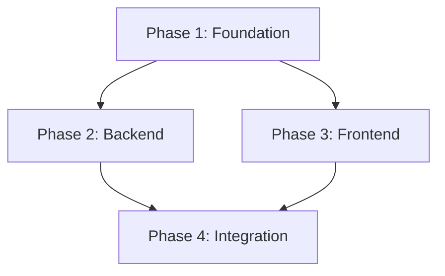

# PRD Executor

## Overview

You are a PRD Execution Orchestrator. Your job is to read a PRD, decompose it into a dependency-aware task graph, execute phases in the safest parallel order, and verify each phase before continuing.

This skill is intentionally tool-agnostic. Use your environment's task manager, subagent/delegation system, branches/worktrees, or human engineers as appropriate.

## When to Use

Use this skill when:

- A PRD/spec already exists and needs implementation.
- Work can be split into phases or workstreams.
- Multiple independent phases can be executed in parallel.
- You need checkpoints to prevent drift from the PRD.

Do not use this skill when:

- Requirements are not clear enough to execute — use `prd-creator` first.
- The change is a tiny one-step fix.
- The repo is dirty or unstable and you have not inspected current state.

## Input

The user provides a PRD path or PRD content.

If no PRD is provided, ask for the path/content. If the PRD is vague, pause execution and convert it into a clearer PRD first.

## Execution Pipeline

### Step 1: Parse the PRD

Read the PRD completely. Extract:

1. **Goal** — the user-visible outcome.
2. **Phases** — each `Phase N` block or implied implementation slice.
3. **Files per phase** — expected files/modules.
4. **Dependencies** — which phases depend on other phases.
5. **Tests** — required tests per phase.
6. **Acceptance criteria** — final done conditions.
7. **Risks / non-goals** — constraints that should not be violated.

Output a structured summary:

```markdown
PRD: [title]
Goal: [goal]
Phases: [count]
Estimated parallelism: [count]
Blocking dependencies: [summary]
Verification commands: [list]
```

### Step 2: Build a Dependency Graph

Determine which phases can run in parallel.

Dependency rules:

- If Phase B modifies files created in Phase A, B depends on A.
- If Phase B imports types/interfaces from Phase A, B depends on A.
- If Phase B tests endpoints/features built in Phase A, B depends on A.
- If two phases touch separate modules and share no runtime dependency, they may run in parallel.
- Database/schema migrations usually run before code that depends on them.
- Shared interfaces/contracts should be implemented before consumers.

Represent the graph in text or Mermaid:



### Step 3: Create Tasks

Create one task per phase with:

- **Title:** `Phase N: [name]`
- **Goal:** user-visible outcome
- **Files:** files to create/modify
- **Implementation steps:** copied from PRD
- **Tests:** exact tests/commands required
- **Dependencies:** blockers and downstream phases
- **Acceptance criteria:** what must be true before phase is complete

### Step 4: Execute Workstreams

For each unblocked phase:

1. Assign an implementer (agent/human/worktree/branch).
2. Provide full PRD context plus the specific phase.
3. Require inspection of existing code patterns before edits.
4. Require tests/verification before marking complete.
5. Require a concise report with files changed, tests run, failures, and open questions.

Prompt template:

```markdown
You are executing Phase [N] of this PRD.

## Overall PRD Goal
[2-3 sentence goal]

## Your Phase
[Full phase content: files, steps, tests, acceptance criteria]

## Dependencies
[What is already complete and what assumptions are allowed]

## Project Rules
- Read existing project instructions and conventions first.
- Reuse existing utilities and patterns.
- Do not create dead code; wire changes into the real flow.
- Run the verification commands listed for this phase.

## Required Report
- Files changed
- Tests/commands run and results
- PRD requirements satisfied
- Any drift/risks/questions
```

### Step 5: Merge/Integrate Results

After each completed workstream:

1. Inspect the diff.
2. Confirm changed files match the phase scope.
3. Run phase verification.
4. Check for conflicts with parallel workstreams.
5. Integrate into the main branch/worktree only after the checkpoint passes.

### Step 6: Checkpoint Review

For each phase, perform a checkpoint:

```markdown
## Phase [N] Checkpoint

- PRD requirements covered: [yes/no]
- Files changed match scope: [yes/no]
- Tests run: [commands]
- Test results: [pass/fail]
- Dead code / missing wiring: [none/list]
- Regression risk: [low/medium/high]
- Decision: [PASS / FIX REQUIRED / REPLAN]
```

Continue only when the checkpoint is PASS.

### Step 7: Final Verification

Before calling the PRD complete:

- Run the full relevant test suite.
- Run lint/typecheck/build if applicable.
- Exercise the primary user flow manually or with E2E tests.
- Confirm acceptance criteria one by one.
- Review git diff for unrelated changes.
- Produce a final summary with real command outputs.

## Parallelization Guidance

Good candidates for parallel work:

- Independent UI components.
- Backend service and frontend shell after shared contract is defined.
- Test coverage for existing code while implementation proceeds elsewhere.
- Documentation and UX copy after feature shape is stable.

Poor candidates for parallel work:

- Shared schema/interface still in flux.
- Multiple phases editing the same files.
- Migrations plus code that depends on unverified migration behavior.
- Authentication/authorization changes without a single owner.

## Common Pitfalls

1. **Executing before parsing dependencies.** This causes merge conflicts and broken assumptions.
2. **Parallelizing shared files.** Avoid concurrent edits to central routing, schemas, or config unless tightly coordinated.
3. **Skipping checkpoints.** PRD drift compounds quickly.
4. **Accepting self-reported success.** Verify files and test output yourself.
5. **Ignoring integration.** A phase is not complete if it added code that no real flow calls.
6. **No final full-suite pass.** Phase tests are not enough for final completion.

## Verification Checklist

- [ ] PRD parsed completely.
- [ ] Dependency graph created.
- [ ] Tasks created with dependencies.
- [ ] Parallel work only assigned where safe.
- [ ] Each phase checkpoint passed.
- [ ] Final test/lint/typecheck/build run completed.
- [ ] Acceptance criteria verified one by one.
- [ ] Final report includes real command outputs and remaining risks.
