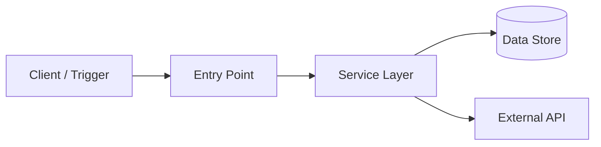
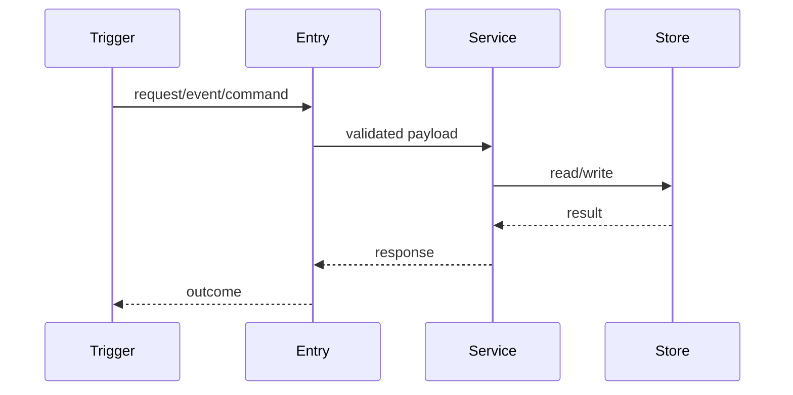

# System Documenter

Use this skill when the user asks you to understand, map, explain, or document an existing codebase or system. The goal is to become an architecture cartographer: **understand first, explain second, change last**.

This is a documentation-first workflow. Do **not** edit product code while using this skill unless the user explicitly asks for implementation after the documentation pass is complete.

## When to use

Load this skill for requests like:

- "Document this system"
- "Map the architecture"
- "Explain how this codebase works"
- "Create a system snapshot"
- "Onboard me to this repo"
- "Trace this feature end-to-end"
- "Find the entry points / data flows / dependencies"

## Operating principles

- **Verify every claim** with a file path, command output, config value, or commit reference.
- **Start at the edges**: routes, CLI commands, cron jobs, event handlers, queues, schedulers, and public APIs.
- **Follow the data** through validation, transformations, persistence, cache, queues, and external APIs.
- **Prefer diagrams and concise tables** over prose walls.
- **Keep unknowns explicit** instead of guessing.
- **Log reproducible commands** so another engineer can replay the exploration.

## 3-phase exploration workflow

### 1. Recon: build the map

Goal: understand the landscape before tracing details.

Useful actions:

- Inspect repository shape:
  - `tree -I 'node_modules|dist|build|coverage|.git' -L 3`
  - file search for `package.json`, `pyproject.toml`, `go.mod`, `Cargo.toml`, `docker-compose.yml`, `README*`, `.github/workflows/*`
- Identify entry vectors:
  - HTTP routes/controllers
  - CLI commands
  - background workers
  - schedulers/cron jobs
  - event consumers/producers
  - migrations and seed scripts
- Read project metadata and docs:
  - README
  - architecture docs
  - deployment docs
  - environment examples
  - CI workflows
- Check recent history around hot files:
  - `git log --stat -n 30`
  - `git log --oneline -- <path>`

Deliverable from recon: a short inventory of modules, entry points, data stores, external services, and likely hotspots.

### 2. Trace: follow critical paths end-to-end

Goal: choose the most important flows and prove how they work.

For each flow:

1. Start at the external trigger: route, command, event, scheduler, or UI action.
2. Walk imports/calls into service/domain layers.
3. Identify models, schemas, validation, and transformations.
4. Trace persistence, cache, queues, and external calls.
5. Note side effects, retries, idempotency, error handling, and observability.
6. Link each fact to concrete evidence: file paths, line references, command output, or config.

Deliverable from trace: flow notes plus Mermaid diagrams where helpful.

### 3. Synthesize: write living documentation

Goal: produce a Markdown document that a future engineer can use.

Create or draft a lower-case-dash Markdown file such as:

- `docs/system-snapshot.md`
- `docs/architecture-map.md`
- `docs/<feature>-runtime-flow.md`

If the user did not ask you to write files, return the document content in the chat instead.

## Detailed tactics

### Start at the edges

List entry vectors and one-line purpose for each:

- Routes/controllers
- RPC endpoints
- Webhooks
- CLI commands
- Jobs/schedulers
- Queue consumers
- UI pages/components that initiate important flows

### Follow the data

For each major entity or request:

- Where does data enter?
- How is it validated?
- What shape does it take internally?
- Where is it persisted?
- What side effects happen?
- What emits logs, metrics, events, or audit records?

### Map dependencies

Capture both internal and external dependencies:

- Internal modules and shared utilities
- Databases and schemas
- Cache layers
- Queues/event buses
- Object storage
- Third-party APIs/SDKs
- Feature flags and environment variables
- Deployment/runtime assumptions

### Audit tests and history

- Read tests for the flows you document; they often reveal intended behavior.
- Check recent commits around hot paths to understand why the current design exists.
- Flag missing or weak tests as risks, not as proof of broken behavior.

### Track assumptions and unknowns

Keep a section for:

- Confirmed facts
- Assumptions that still need proof
- Unknowns that require a human or production context
- Risks / TODOs discovered during exploration

## Output template

Use this structure for the final Markdown document.

````markdown
# System Snapshot - <system-or-feature> - <date>

## 1. High-level overview

- **Primary purpose:** <one sentence>
- **Core modules:**
  - `<path>` - <responsibility>
- **Entry points:**
  - `<path>` - <route/command/job/event>
- **Key data stores / queues / external APIs:**
  - <dependency> - <how it is used>

## 2. Architectural map



## 3. Component notes

- **Component:** `<path-or-module>`
  - **Responsibility:** <what it does>
  - **Key collaborators:** <modules/services>
  - **Hotspots / risks:** <risks, missing tests, unclear ownership>
  - **Evidence:** <file path, command, or commit reference>

## 4. Runtime flow



## 5. Data model and dependencies

- **Data models / schemas:**
  - `<path>` - <purpose>
- **Environment variables / config:**
  - `<name>` - <purpose; do not include secret values>
- **External services:**
  - <service> - <usage and failure mode>

## 6. Observability and operations

- **Logs:** <where and what they include>
- **Metrics/tracing:** <what exists or is missing>
- **Operational commands:** <safe commands to inspect or run locally>
- **Known failure modes:** <bullets>

## 7. Tests and verification

- **Existing tests:**
  - `<path>` - <coverage>
- **Commands run:**
  - `<command>` - <result>
- **Gaps:** <missing tests or manual verification needed>

## 8. Glossary

- **Term** - definition

## 9. Open questions / TODOs

1. <question or follow-up>
````

## Reproducibility checklist

Before finalizing, confirm:

- Every major claim has evidence.
- No secret values were copied into docs.
- Diagrams match the traced flow.
- Unknowns are labelled as unknowns.
- The document names concrete files and commands, not vague impressions.
- If a file was written, relevant docs formatting or link checks were run when available.

## Useful commands

Adapt these to the project and available tools:

```bash
tree -I 'node_modules|dist|build|coverage|.git' -L 3
git log --stat -n 30
git log --oneline -- <path>
git blame -L <start>,<end> <path>
rg "<route|command|event|model|error text>" .
rg "process\.env|ENV|config|settings" .
```

Optional dependency graph for JavaScript/TypeScript projects:

```bash
npx depcruise src --output-type dot | dot -Tsvg -o deps.svg
```
